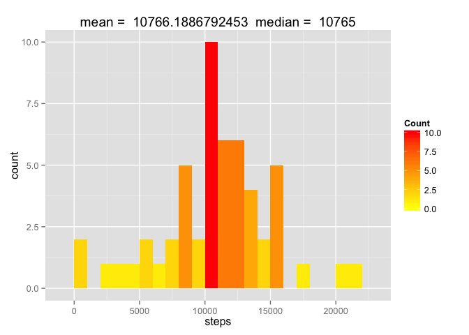
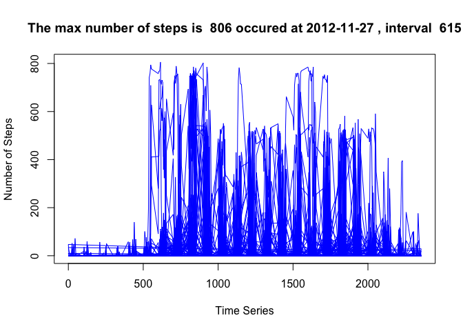
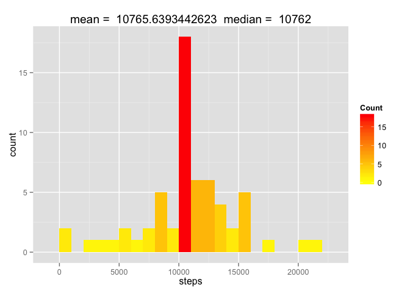
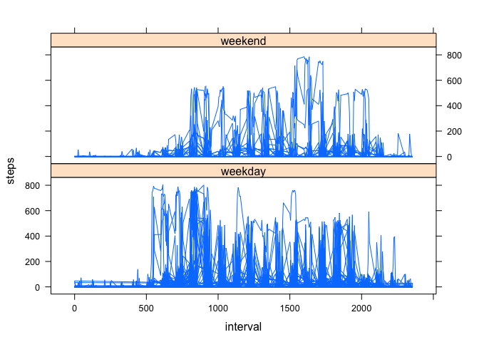

# Reproducible Research: Peer Assessment 1


## Loading and preprocessing the data
Presentation layer is split from logic which is stored in 'activity.R'

```r
source('./activity.R')
```


## What is the mean total number of steps taken per day?

```r
activity_frame_complete <- read.csv('activity.csv')
valid_rows <- !is.na( activity_frame_complete$steps )
activity_frame <- activity_frame_complete[valid_rows,]

aggregate_steps.sum <- aggregate( steps ~ date, activity_frame, sum )
aggregate_steps.mean <- aggregate( steps ~ date, activity_frame, mean)

aggregate_steps.mean_by_interval <- aggregate( steps ~ interval, activity_frame, mean)
paste( "The mean total number of steps is", mean(aggregate_steps.sum$steps))
```

```
## [1] "The mean total number of steps is 10766.1886792453"
```

```r
paste( "The median total number of steps is", median(aggregate_steps.sum$steps))
```

```
## [1] "The median total number of steps is 10765"
```

```r
generate_histogram( aggregate_steps.sum )
```

 


## What is the average daily activity pattern?

```r
highest_number_steps <- activity_frame[activity_frame$steps == max( activity_frame$steps ), ]
activity_plot.title <- paste( "The max number of steps is ", highest_number_steps$steps,"occured at", highest_number_steps$date, ", interval ", highest_number_steps$interval, sep = " ")

plot( activity_frame$interval, activity_frame$steps, type = "l", xlab = "Time Series", ylab="Number of Steps", col="blue", main  = activity_plot.title)
```

 


## Imputing missing values

```r
total_missing_values <- sum( is.na( activity_frame_complete$steps) )
paste( "The total number of missing values are", total_missing_values)
```

```
## [1] "The total number of missing values are 2304"
```

```r
activity_frame_mod <- fill_in_blanks( activity_frame_complete, aggregate_steps.mean_by_interval )
aggregate_steps.sum.mod <- aggregate( steps ~ date, activity_frame_mod, sum )
generate_histogram( aggregate_steps.sum.mod)
```

 


## Are there differences in activity patterns between weekdays and weekends?
Yes, there is much more activity on the weekdays as shown by the denser plots for the weekend.

```r
  activity_frame_mod$kind_of_day <- convert_to_date_factor( activity_frame_mod$date )
  xyplot( steps ~ interval|kind_of_day, data=activity_frame_mod, type = "l", layout = c(1,2))
```

 
